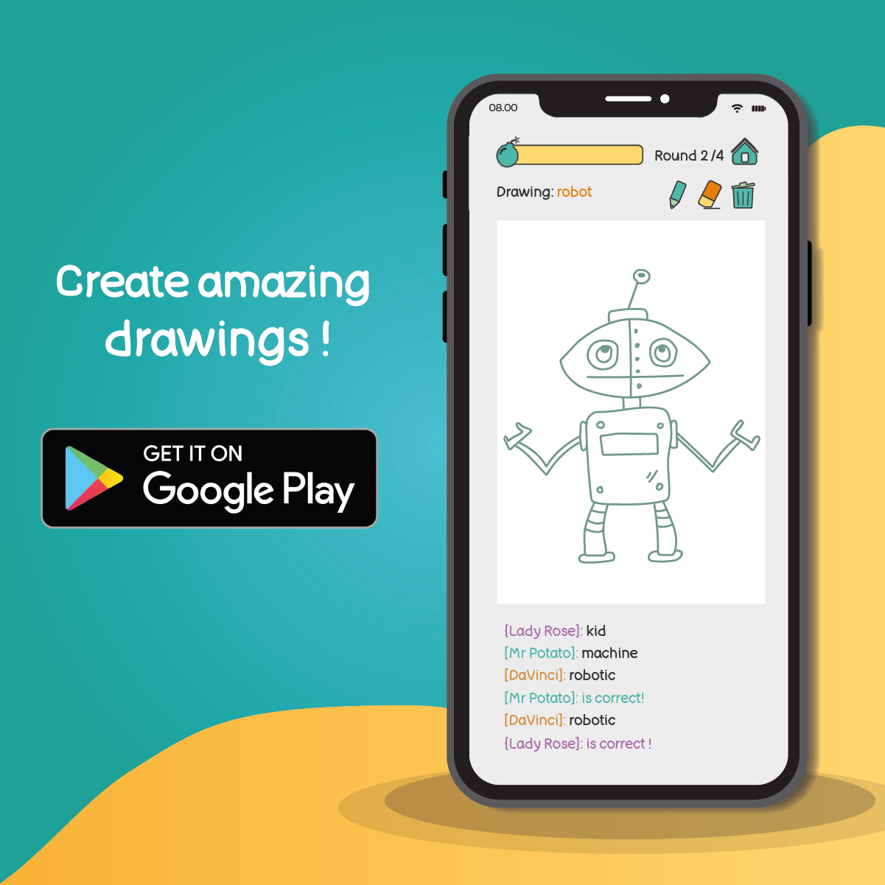

# Rabiscos

Rabiscos is an online multiplayer drawing and guessing game.
One game consists of a few rounds in which every round someone has to draw their chosen word and others have to guess it to gain points!
The person with the most points at the end of the game will then be crowned as the winner!

### How to play:

When its your turn to draw, you will have to choose a word from three options and visualize that word in 80 seconds, alternatively when somebody else is drawing you have to type your guess into the chat to gain points, be quick, the earlier you guess a word the more points you get!

- Multiplayer online game
- Pictionary like drawing game
- Optimized for phones and tablets
- Made with Godot

Imagination is the limit, what are you waiting for?

### Find out more:
https://play.google.com/store/apps/details?id=pt.threeninjasgaming.rabiscos

